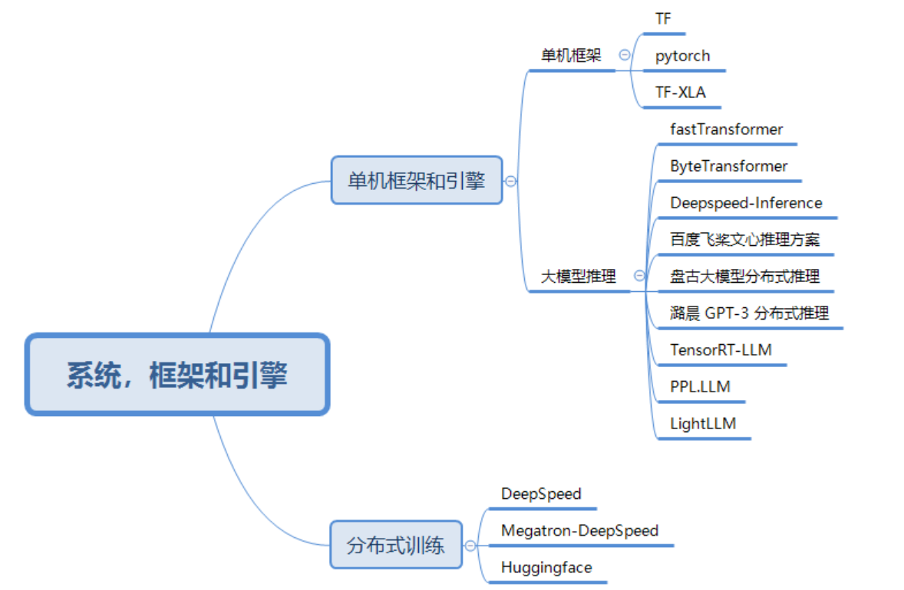

## 概要

想要搞清楚几件事
1. 大模型的技术栈，纵向全栈，横向对比
   1. 有哪些技术路线，大模型的演进过程
   2. 关键技术有哪些
2. 如何训练及部署大模型

一些更细但是关键的问题
1. 训练的过程是怎样的，有哪些步骤
2. 显存问题
3. 通信问题
4. 优化器
5. loss 和梯度曲线
6. 关键算子的性能
7. 分布式训练的问题

## Reference: 
1. [github, DeepSpeed](https://github.com/microsoft/DeepSpeed): DeepSpeed is a deep learning optimization library that makes distributed training and inference easy, efficient, and effective.
2. [知乎，PyTorch 之 Checkpoint 机制解析](https://zhuanlan.zhihu.com/p/455541708)
