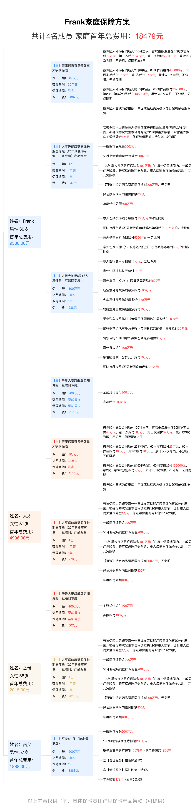

- [1. 保险一扫盲及初步配置](#1-保险一扫盲及初步配置)
- [2. 什么是风险/保险](#2-什么是风险保险)
- [3. 保险行业如何](#3-保险行业如何)
- [4. 保险产品介绍](#4-保险产品介绍)
  - [4.1. 重疾险](#41-重疾险)
  - [4.2. 寿险](#42-寿险)
  - [4.3. 医疗险](#43-医疗险)
  - [4.4. 意外险](#44-意外险)
- [5. 如何配置保险](#5-如何配置保险)
  - [5.1. 方法论(原则/步骤)](#51-方法论原则步骤)
  - [5.2. 具体案例](#52-具体案例)
    - [5.2.1. 配置结果的评估](#521-配置结果的评估)
      - [5.2.1.1. 男方(家庭主要收入来源)保险配置评估](#5211-男方家庭主要收入来源保险配置评估)
      - [5.2.1.2. 女方保险配置评估](#5212-女方保险配置评估)
    - [5.2.2. 最终配置结果](#522-最终配置结果)
- [6. 后续](#6-后续)
- [7. 参考资料](#7-参考资料)

# 1. 保险一扫盲及初步配置

这篇文章是笔者自己（非保险专业人士）最近配置保险做的调研和实操的结果。主要为了回答以下几个问题：

- 什么是风险/保险
- 保险行业怎么样
- 保险产品是怎样的
- 如何配置保险，结合一个实例说明

先说结论，

- 保险很重要！很重要！很重要！
- 越早越好，最好能 30 岁之前就能配置好。
- 家庭经济支柱优先配置。
- 个人配置意见：只需要考虑 4 种极端风险就好。

# 2. 什么是风险/保险

已经年过而立，愈发觉得自己不再是一人吃饱全家不饿，首先要解决钱的问题，而要解决钱的问题，先考虑还不是挣多少钱，而是花多少钱。简言之，要守住钱袋子，避免一夜回到解放前。

小概率事件很少发生，却几乎决定了事情的发展走向。我们需要讨论的是不好的小概率事件，极端风险，包括【身故】【意外身故】【意外全残】【重疾】。**保险要做的事情不是避免风险发生，而是降低或者是消解风险产生的经济后果**。
当然还有很多其他风险，但是我们重点关心这些影响人生轨迹的风险。后面也仅讨论这 4 个风险。这些风险一旦发生，可能会产生两个经济后果，

1. 经济收入急剧下跌
2. 需要高额的治疗费用

保险要做的就是消解这两个风险，对于收入下跌，保险公司一次性赔付，对于高额医疗费用，保险公司来报销。

# 3. 保险行业如何

在此之前，笔者（以及身边的人）对保险行业都有刻板印象：低文化水平的保险代理人忽悠自己的亲朋好友买各种“用不上”的保险，买卖保险的人都不清楚保险的逻辑以及保险产品的应用场景。

经过一番调研发现我国的保险行业监管是世界上最严的，其监管机构就是[银保监会][baojianhui]。任何一个获得授权的保险公司，再小其实也都是巨头。且其监管和保障体系相当完善了。其实某种程度上银行都没保险公司可靠，因为银行也需要保险来兜底。保险公司即便倒闭了，人寿保单依然生效，会转给其他保险公司。

# 4. 保险产品介绍

这里只讨论个人保障型保险，包括重疾险，医疗险，寿险，意外险。一般家庭配置以上保险就可以覆盖我们上面提到的 4 个极端风险。

根据理赔方式不同可以分为赔付型，报销型两类产品。其中（百万）医疗险是报销型，也就是报销看病花的钱。重疾险和寿险都是赔付型，一旦触发直接赔付一定额度的钱（等于保单的保额）。意外险则既包括意外伤残导致的医药费报销和意外身故导致的赔付。

> 需要特别说明，保险产品条款非常复杂，缺少背景，很容易被这些纷繁的信息绕晕，找不到重点。这也是为啥要找一个靠谱的保险经纪人，让他帮你全局规划。不过即便如此，投保人也应该自己补充相关常识，因为家庭（个人）的状况自己最清楚，保险配置也应该随着家庭（个人）状况的变化而调整，具备了保险的基础知识，才能和经纪人更有效地沟通，合理配置保险。

## 4.1. 重疾险

[达尔文 7 号](https://cps.qixin18.com/m/apps/cps/sdc1089040/product/detail?prodId=104502&planId=129440&tenantId=-1达尔文7号重大疾病保险)

**这里不是推荐这个产品，强烈建议读者可以点进去看这个重疾险的具体配置，去感受一下各种配置的权利和义务**。

重疾险是保险配置中的大头，占比 70%以上。

笔者做一个简单的汇总，我比较看重几个点：

1. 保额，第一优先级，是上面提到的赔付的额度；
2. 保障期间，一般可以分为 60 岁以内，或者终身，也会极大影响保额；
3. 60 岁前增加赔付比例，一般是 50%-100%，比如保额是 50 万，如果增加 50%就是 75 万；

其他一些不是关键的点，建议读者不要过分关注，以免带偏整体把控：

1. 覆盖重疾种类，最不重要的，因为银保监局已经把常见重疾做了硬性要求，其他的是小概率事件中的小概率事件了；
2. 身故责任，会极大影响保费，建议可以用寿险覆盖；
3. 轻中症赔付，多次赔付都是次要的，评估极端情况就够了；
4. 豁免，触发重症后不用再交保费，一般重疾险都会有的，没有的话要小心；

## 4.2. 寿险

[鼎诚定海柱 2 号定期寿险（互联网专属）](https://cps.qixin18.com/apps/cps/sdc1089040/product/detail?prodId=104401&planId=129234&aid=&tenantId=-1鼎诚定海柱2号定期寿险)

**这里不是推荐这个产品，强烈建议读者可以点进去看这个重疾险的具体配置，去感受一下各种配置的权利和义务**。

寿险的配置比例仅次于重疾险。主要应对身故/[全残][quancan]风险.

## 4.3. 医疗险

[e 享护-医享无忧百万医疗险（20 年期）-个人版](https://cps.qixin18.com/apps/cps/sdc1089040/product/detail?prodId=104386&planId=129184&aid=&tenantId=-1e)

**这里不是推荐这个产品，强烈建议读者可以点进去看这个重疾险的具体配置，去感受一下各种配置的权利和义务**。

医疗险是报销型的，可以非常有效地应对看病贵，看病难的问题也可以配置高配医疗险，费用差别是 200 到 1000 。

医疗险的重点是趁早配置，趁自己身体还好，年纪在可保范围内来配置。尤其快到 60 岁的人，一定要尽快安排上。很多保险产品都是可以 20 年续保的。

## 4.4. 意外险

[小蜜蜂 3 号综合意外险 尊享版](https://cps.qixin18.com/apps/cps/sdc1089040/product/detail?prodId=104523&planId=129473&aid=&tenantId=-1小蜜蜂3号综合意外险)

**这里不是推荐这个产品，强烈建议读者可以点进去看这个重疾险的具体配置，去感受一下各种配置的权利和义务**。

应对交通事故等意外导致的伤残风险。这部分保费非常低，应该不缺这点保费。

# 5. 如何配置保险

## 5.1. 方法论(原则/步骤)

原则如下

1. 重点评估极端风险场景的覆盖情况；
2. 保险配置应该是一套组合方案，不同的人保险方案都不一样，不要太关注具体产品选择，那是经纪人的事情；
3. 多咨询几个保险经纪人，对比一下，基本就能避坑骗保；

大致步骤如下

1. 找合适的经纪人（不止一个，对比挑一挑）；
2. 自己学习保险相关常识，了解保险配置的基本框架；
3. 和经纪人反复沟通需求，调整方案；

## 5.2. 具体案例

一个家庭配置，基本情况，家庭中男女生均 30 岁，房贷 200 万，年入 50 万，开销（包括房贷） 30 万，男方是家庭的经济主要来源。保费预算 2 万。

### 5.2.1. 配置结果的评估

#### 5.2.1.1. 男方(家庭主要收入来源)保险配置评估

|     风险     |     重疾险 |      医疗险 |        寿险 |      意外险 | 合计                     |
| :----------: | ---------: | ----------: | ----------: | ----------: | ------------------------ |
| 重大疾病身故 | 赔付 75 万 |          -- | 赔付 200 万 |          -- | 赔付 275 万              |
|   意外身故   |         -- |          -- | 赔付 200 万 | 赔付 100 万 | 赔付 300 万              |
|   意外全残   |         -- | 报销 200 万 | 赔付 200 万 | 赔付 100 万 | 赔付 300 万，报销 200 万 |
|   重大疾病   | 赔付 75 万 | 报销 400 万 |          -- |          -- | 赔付 75 万，报销 400 万  |
|     保费     |       6867 |         247 |        2178 |         288 | 9580                     |

#### 5.2.1.2. 女方保险配置评估

|     风险     |     重疾险 |      医疗险 |        寿险 |      意外险 | 合计                     |
| :----------: | ---------: | ----------: | ----------: | ----------: | ------------------------ |
| 重大疾病身故 | 赔付 50 万 |          -- | 赔付 100 万 |          -- | 赔付 150 万              |
|   意外身故   |         -- |          -- | 赔付 100 万 | 赔付 100 万 | 赔付 200 万              |
|   意外全残   |         -- | 报销 200 万 | 赔付 100 万 | 赔付 100 万 | 赔付 200 万，报销 200 万 |
|   重大疾病   | 赔付 50 万 | 报销 400 万 |          -- |          -- | 赔付 50 万，报销 400 万  |
|     保费     |       4110 |         279 |         607 |         288 | 5284                     |

### 5.2.2. 最终配置结果

# 6. 后续

主要是理赔事项的关注，以及优化配置。

1. 理赔相关，如何理赔，理赔对治疗的影响
2. 医疗险的高额配置，VIP 通道等
3. 境外保险配置

# 7. 参考资料

[baojianhui]: https://www.cbirc.gov.cn/cn/view/pages/index/index.html
[quancan]: https://zhuanlan.zhihu.com/p/27513776

- [1 小时搞定全家保险](https://book.douban.com/subject/35232580/)
- [保险公司 wikipedia](https://en.wikipedia.org/wiki/Insurance#Insurance_companies)
- [保险公司和银行，哪个更安全](https://zhuanlan.zhihu.com/p/528130445)
- [【保险内幕】我用在保险公司的亲身经验，告诉你保险公司到底有多…](https://zhuanlan.zhihu.com/p/145272776?utm_source=wechat_session&utm_medium=social&utm_oi=48243891240960)
- [全面测评 152 款重疾险，选出 2020 年 6 月性价比之王](https://zhuanlan.zhihu.com/p/150438452?utm_id=0)
