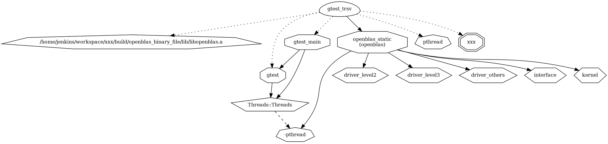

### Reference

1. home page: [Graphviz](https://graphviz.org/)
2. user guide: [User Guide — graphviz 0.20.1 documentation](https://graphviz.readthedocs.io/en/stable/manual.html)
3. repo: [graphviz / graphviz · GitLab](https://gitlab.com/graphviz/graphviz)
4. wiki: [Graphviz - Wikipedia](https://en.wikipedia.org/wiki/Graphviz#Applications_that_use_Graphviz)

### Introduction

非常棒的学习对象，学习构建一个自己的工具。不少常见应用（confluence, doxygen, sphinx 等）都通过插件的方式用上它。

1. 提供 python 接口，可以快速构图
2. 提供 cmd line，包括 dot 等多个 binary
3. 提供插件，给 confluence，doxygen 等提供服务
4. 定义了 dot 语言

### Example

1. 生成 dot 文件 `cmake --graphviz=dot_file_prefix ..` 每个目标都会生成一个 dot 文件
2. 将 dot 文件转成图片， `dot -Tsvg graph_sublas.dot.gtest_trsv > graph_trsv.svg`

dot 语言如下

### summary

学习 graphviz 来制作一个属于自己的工具。

### todo

cmake 是如何集成 graphviz 的，graphviz 是如何让 cmake 集成的。
