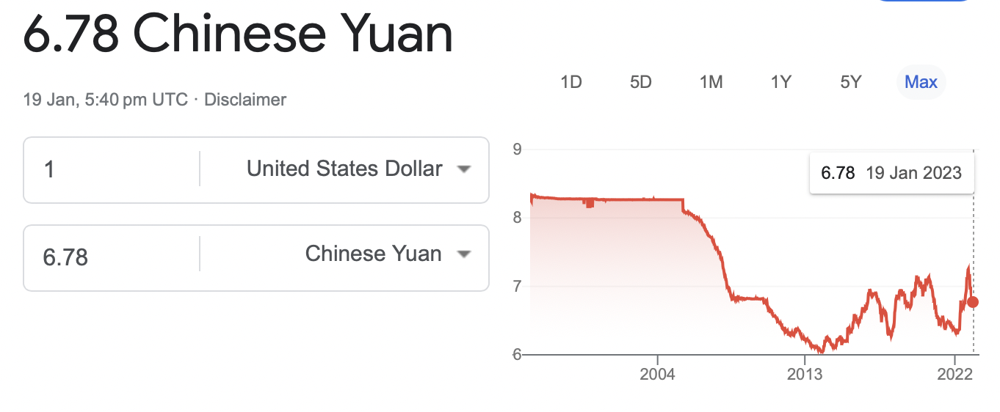

- [1. 目标](#1-目标)
- [2. 扫盲](#2-扫盲)
  - [2.1. 保险的本质](#21-保险的本质)
  - [2.2. 保险产品的价格](#22-保险产品的价格)
  - [2.3. 理赔](#23-理赔)
  - [2.4. 社会保障体系](#24-社会保障体系)
    - [2.4.1. 医疗保险](#241-医疗保险)
    - [2.4.2. 养老保险](#242-养老保险)
  - [2.5. 商业保险](#25-商业保险)
    - [2.5.1. 医疗险](#251-医疗险)
  - [误区](#误区)
    - [不仅是保险产品](#不仅是保险产品)
  - [保险的几种场景](#保险的几种场景)
    - [大病](#大病)
    - [意外](#意外)
    - [自然身故](#自然身故)
    - [延伸出的服务](#延伸出的服务)
  - [不同个人/家庭的风险分析和保险规划](#不同个人家庭的风险分析和保险规划)
  - [todo](#todo)
- [3. 保险选购](#3-保险选购)
  - [3.1. 国内保险 vs 境外保险](#31-国内保险-vs-境外保险)
  - [3.2. 美金 vs 人民币](#32-美金-vs-人民币)
  - [3.3. 一小时搞定全家保险](#33-一小时搞定全家保险)

# 1. 目标

- [ ] 父母大病医疗
- [ ] 第三方保险平台是否靠谱，大童是否靠谱
- [ ] 保诚只给了重疾险，寿险啥的不用？
- [ ] 保险配置多少钱合适？
- [ ] 保险养老？
- [ ] 国内保险道道多是不靠谱表现还是更加创新？对消费者是利大于弊还是相反？
- [ ] 社保缴够 15 年之后还有必要缴吗？
- [ ] 境内境外保险/资产配置的考虑
- [ ] 有没有保险计算器可以直接算出来保额和保费
- [ ] 保险和银行哪个更稳定？

# 2. 扫盲

## 2.1. 保险的本质

保险的本质是：用大家共同的钱来消解风险对个体的巨大冲击。

设计保险产品需满足两个条件

1. 稳定可统计发生概率的风险，尽量避免可人为制造的风险
2. 风险及理赔可操作

## 2.2. 保险产品的价格

影响价格的两个大方面，出险频率，和执行管理成本。

## 2.3. 理赔

两种理赔方式

1. 报销，给个上限，降低损失
2. 赔偿，约定保额，可以获得更多现金流

## 2.4. 社会保障体系

领的长和领钱多少一样重要。社会保障体系的关键价值在于它是终身的。

### 2.4.1. 医疗保险

甲乙丙三类，丙类不报销。乙类部分报销。

### 2.4.2. 养老保险

北京 2016 年企业退休 3500。

## 2.5. 商业保险

### 2.5.1. 医疗险

覆盖大病报销，一般一年 1000 不到，之所以价格低，因为门槛高，去掉医保报销，以及免赔额（一般 1-2w）后才报销剩余部分。

## 误区

### 不仅是保险产品

服务人员，保险公司，保险产品，前两者可能比产品来得更重要。

## 保险的几种场景

### 大病

产生医疗费用和日常生活开销。

### 意外

包括意外大病和身故。

### 自然身故

比遗嘱更加便捷地配置遗产。

### 延伸出的服务

转移资产

## 不同个人/家庭的风险分析和保险规划

1. 单身阶段，主要风险在高额医疗费，意外多于大病
2. 家庭初期，风险增加了房贷，家庭开销，需要新增赔付型保险
3. 家庭中期，收入与压力都增加
4. 家庭后期，子女完成学业，家庭财富达到高点，准备养老金

高额医疗费用支出是首先要保险的。

最终方案

|        | 男主 | 女主 |
| ------ | :--: | :--: |
| 医疗险 |  Y   |  Y   |
| 寿险   |  Y   |  Y   |
| 重疾险 |  Y   |  N   |

> 父母大病医疗，自己养老，子女教育是未来的重要支出。

> 笔者给大家算算账，22 岁的年轻人， 如果全用消费型的保险，提供 80 万重疾保障、100 万意外保险， 每年一共才 1510 元。如果经常出差， 再加上交通意外保险，譬如航空意外险 800 万，全年也不过 180 元， 这些费用每个年轻人都可以承受。

> 豁免缴费

上面这个例子真心便宜了。

已经经过第一个个人五年发展，家庭两年发展，可以说进入家庭初中期阶段，收入有明显提升，但是支出也明显增加，压力变大。

## todo

1. 需要考虑投资性收入
2.

# 3. 保险选购

重疾险是重点，直接给付，费用最高。可以有的功能

1. 如遇重疾，抵御风险
2. 储蓄分红，理财需求

## 3.1. 国内保险 vs 境外保险

境外比如香港，是用美金。今日汇率 6.77.

| 重疾险对比 |           境内￥ |                    境外$ |
| :--------: | ---------------: | -----------------------: |
|    保费    |            15816 |              2304(15598) |
|   缴费期   |            30 年 |                    20 年 |
|   总保费   |            47.4w |              4.6w(31.1w) |
|  基础保额  | 50w+30w(60 岁前) |              12w(81.24w) |
|  保额变动  |             固定 | 逐年增长,66 岁 21w(142w) |
|  一次给付  |           分多次 |                   一次性 |
|  身故风险  |       见基础保额 |     没有提到（需要确认） |

总结：境外的更加加单单纯，直接，且没有出险还可以当养老金。境内的保险，就像我们的运营商的套餐业务一样，复杂，把人绕晕。性价比远低于境外的保险。

观点：[国外保险比国内的好](https://zhuanlan.zhihu.com/p/551224568)

国内诚信缺失，运营成本高。查勘，审核成本高。除了防客户，还要防内部工作人员，经营管理不善。
国内手续费高，保险法曾规定 8%，实际 25-35%，后取消该规定。

## 3.2. 美金 vs 人民币

1. 多一个外国货币储备有什么用？有什么限制？
2. 如何选择外国货币
3. 具体操作

[纪录片监守自盗](https://www.bilibili.com/video/BV1g5411P7WR/?spm_id_from=333.337.search-card.all.click&vd_source=f59ffd589ead58713c6246a06c23fd9d): 2008 金融危机经过

## 3.3. 一小时搞定全家保险

[境外（香港）保险格外香](https://www.zhihu.com/market/pub/119961593/manuscript/1283993794682322944)

合法拥有外币收入才可能正常地购买非内地的保险。

合理规划思路，保险的底层逻辑是关键。
风险的含义是后果严重到让自己不能承受的事件
